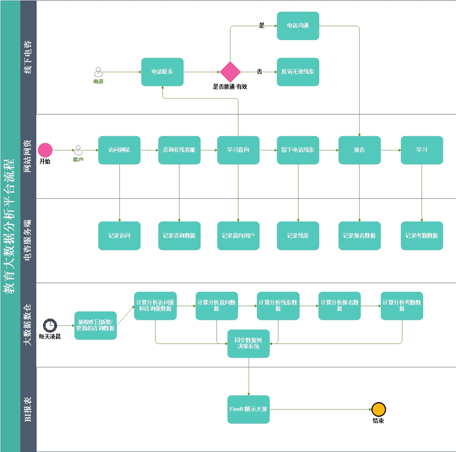
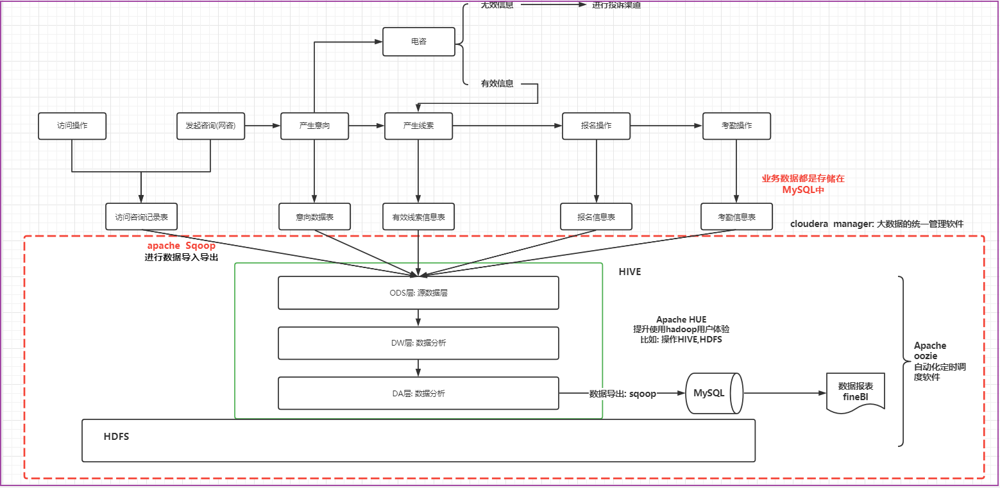
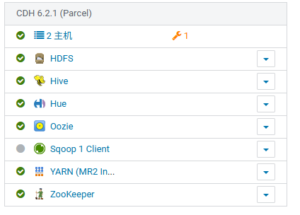
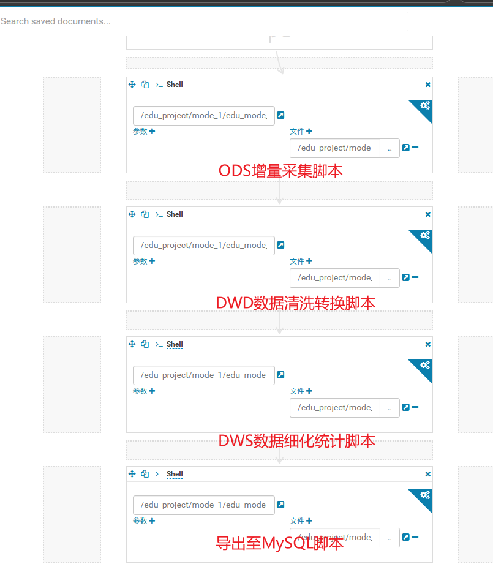
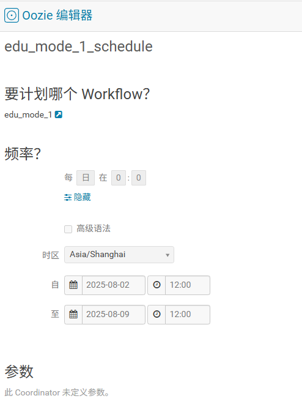
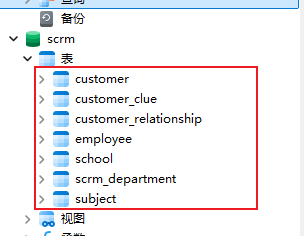
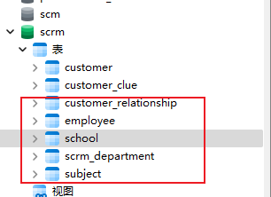
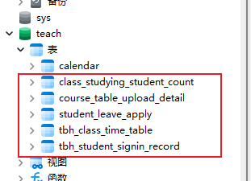

# 1.项目介绍和需求管理

## 1.1 项目介绍

### 1.1.1 背景介绍

近年来，在线教育产业发展十分迅速。尤其是2018年以来，在线教育平台动作不断，除了洋葱数学、考虫、作业盒子、火花思维、VIPKID、阿卡索等平台纷纷融资外，诸多在线教育平台纷纷上市。新东方在线也在2019年3月成功上市。

在市场规模方面，在线教育很大程度上是随着移动互联网的浪潮发展起来的，在传统的PC时代，虽然出现了网络教育形式，但是真正的所谓在线教育仍然是在2011年左右开始爆发的，这也正是移动互联网发展和普及的时间点。

统计数据显示，**2011-2017年**中国在线教育市场规模呈逐年增长趋势。2011年中国在线教育市场规模已达574.9亿元，2014年中国在线教育市场规模突破了千亿元，截止至2017年中国在线教育市场规模增长至突破2000亿元，达到了2089.1亿元，同比增长28.1%。2018年我国在线教育市场规模达到2670.6亿元左右。中国在线教育市场规模同比增长稳健。

### 1.1.2 行业发展的痛点

​    受互联网+概念的催化，教育市场发展火热，越来越多的教育机构和平台不断涌现，包括有线上学习和线下培训，K12教育和职业教育等，那些注重用户服务、教育质量的平台会最终胜出。目前的**企业****痛点**：

1. 数据量大，现有MySQL业务数据库直接读取模式不能满足业务统计性能、效率需要
2. 系统多、数据分散，缺少从营销、咨询、报名、教学等等完整业务环节的数据贯通
3. 统计分析难度高、工作量大。缺少元数据、数据集合的规范存储，业务部门有数据分析角度需求时，需要程序员、DBA突击查数据、做报表，尤其年底各个部门排队等DBA协助出数据

如何提高用户服务水平，提高教育质量是每个机构都面临的问题。信息的共享和利用不充分，就导致尽管学校多年的信息化应用积累了大量的数据，但信息孤岛的壁垒一直没有打破，对这些数据无法进一步的挖掘、分析、加工、整理，不能给学校教育、教学、研发、总务等各方面管理决策提供科学、有效的数据支撑。

### 1.1.3 大数据技术的应用

大数据技术的应用可以从海量的用户行为数据中进行挖掘分析，根据分析结果优化平台的服务质量，最终满足用户的需求。教育大数据分析平台项目就是将大数据技术应用于教育培训领域，为企业经营提供数据支撑：

1. 建立集团数据仓库，统一集团数据中心，把分散的业务数据进行预先处理和存储
2. 根据业务分析需要，从海量的用户行为数据中进行挖掘分析，定制多维的数据集合，形成数据集市，供各个场景主题使用
3. 前端业务数据展示选择和控制，选取合适的前端数据统计、分析结果展示工具

1.1.4 教育平台流程




#  教育项目的架构说明



```properties
项目架构中: 数据流转的流程
	首先业务是存储在MySQL数据库中, 通过sqoop对MySQL的数据进行数据的导入操作, 将数据导入到HIVE的ODS层中, 对数据进行清洗转换成处理工作, 处理之后对数据进行统计分析, 将统计分析的结果基于sqoop在导出到MySQL中, 最后使用finebi实现图表展示操作, 由于分析工作是需要周期性干活, 采用ooize进行自动化的调度工作, 整个项目是基于cloudera manager进行统一监控管理
```

项目软件使用版本情况：

Vmware Workstation	17.6.2	

cent OS 			7.6

MySQL			8.0.31

CDH				6.2.1



```properties
各个软件相关作用:
	zookeeper: 集群管理工具, 主要服务于hadoop高可用以及其他基于zookeeper管理的大数据软件
	HDFS:  主要负责最终数据的存储
	YARN: 主要提供资源的分配
	HIVE: 用于编写SQL, 进行数据分析
	oozie:  主要是用来做自动化定时调度
	sqoop: 主要是用于数据的导入导出
	HUE: 提升操作hadoop用户体验, 可以基于HUE操作HDFS, HIVE ....
	FINEBI: 由帆软公司提供的一款进行数据报表展示工具
```

## .1 每份数据表采用分区储存

```sql
PARTITIONED BY (yearinfo string,quarterinfo STRING, monthinfo STRING, dayinfo string)
```

方便数据细分统计以及的下钻处理


## .2 优化经验建议

**该项目要求在个人PC上的稳定运行。整体配置遵循思想为:"宁可慢，不能崩"。**

全部使用过的配置项如下，根据需求酌情使用

```sql
-- 关闭hive自主优化
set hive.auto.convert.join=false;
-- 分区
SET hive.exec.dynamic.partition=true;
SET hive.exec.dynamic.partition.mode=nonstrict;
set hive.exec.max.dynamic.partitions.pernode=10000;
set hive.exec.max.dynamic.partitions=100000;
set hive.exec.max.created.files=150000;
-- hive压缩
set hive.exec.compress.intermediate=true;
set hive.exec.compress.output=true;
-- 写入时压缩生效
set hive.exec.orc.compression.strategy=COMPRESSION;
-- 分桶
--set hive.enforce.bucketing=true;
--set hive.enforce.sorting=true;
--set hive.optimize.bucketmapjoin = true;
--set hive.auto.convert.sortmerge.join=true;
--set hive.auto.convert.sortmerge.join.noconditionaltask=true;
-- 并行执行
set hive.exec.parallel=true;
set hive.exec.parallel.thread.number=8;
-- 小文件合并
set mapred.max.split.size=2147483648;
set mapred.min.split.size.per.node=1000000000;
set mapred.min.split.size.per.rack=1000000000;
-- 矢量化查询
set hive.vectorized.execution.enabled=true;
-- 关联优化器
set hive.optimize.correlation=true;
-- 读取零拷贝
set hive.exec.orc.zerocopy=true;
-- join数据倾斜
set hive.optimize.skewjoin=false;
-- set hive.skewjoin.key=100000;
set hive.optimize.skewjoin.compiletime=false;
set hive.optimize.union.remove=false;
-- group倾斜
set hive.groupby.skewindata=false;
```

```properties
这套配置主要做了以下几件事：

1.支持大规模动态分区（解决写入问题）

2.启用压缩（减少磁盘和网络IO）

3.启用并行执行和矢量化查询（提升计算效率）

4.关闭了大多数“高级”且可能不稳定的优化（保证稳定性）
```

详细优化配置整理见文档 -- [优化配置.md]

[.\Configure items\优化配置.md]: 


# 数据添加

由于所获资料中数据不全，如subject_id课程id全部为空，无法统计课程相关需求，现手动添加数据


使用了python进行自动化数据填充，代码如下。其余空值字段如学校、部门等亦同，大大提高数据丰富度。实现高效自动化增删改

```python
import pymysql
import random
from pymysql.cursors import DictCursor
def update_null_rows_pymysql(host, port, user, password, database, table_name, column_name):
    """
    使用PyMySQL为MySQL数据库中全NULL字段分配随机数字
    """
    try:
        # 建立数据库连接
        connection = pymysql.connect(
            host=host,
            port=port,
            user=user,
            password=password,
            database=database,
            charset='utf8mb4',
            cursorclass=DictCursor  # 返回字典格式的结果
        )
        with connection:
            with connection.cursor() as cursor:
                # 1. 查询所有需要更新的行
                query = f"""
                    SELECT id
                    FROM {table_name} 
                    WHERE {column_name} IS NULL
                """
                cursor.execute(query)
                null_rows = cursor.fetchall()
                print(f"找到 {len(null_rows)} 行需要更新")
                # 2. 为每行生成随机数并更新
                for row in null_rows:
                    random_number = random.randint(1, 21)  # 1-21的随机整数
                    update_query = f"""
                        UPDATE {table_name} 
                        SET {column_name} = %s 
                        WHERE id = %s
                    """
                    cursor.execute(update_query, (random_number, row['id']))
                # 3. 提交事务
                connection.commit()
                print("更新完成！")
    except pymysql.Error as e:
        print(f"数据库操作错误: {e}")
        if 'connection' in locals():
            connection.rollback()  # 发生错误时回滚
if __name__ == "__main__":
    update_null_rows_pymysql(
        host='192.168.52.150',
        port=3306,
        user='root',
        password='123456',
        database='scrm',
        table_name='customer_relationship',
        column_name='itcast_subject_id'
    )
```


# 2.访问咨询主题看板

## 2.1 全量流程

### 2.1 数据来源:

​	web_chat_ems_2019_07

​	web_chat_text_ems_2019_07

### 2.2 需求分析:

- 需求一:  统计指定时间段内，访问客户的总数量。能够下钻到小时数据。

  ```properties
  涉及维度:
  	时间维度 : 年 季度  月  天 小时
  涉及指标: 
  	访问量
  	
  涉及到表:
  	web_chat_ems_2019_07 (事实表)
  涉及到字段:
  	时间维度:  create_time
  		转换操作: 将create_time后期转换为 yearinfo , quarterinfo,monthinfo,dayinfo,hourinfo需求二: 统计指定时间段内，访问客户中各区域人数热力图。能够下钻到小时数据。
  ```

- 需求二: 统计指定时间段内，访问客户中各区域人数热力图。能够下钻到小时数据。

```properties
涉及维度:
	时间维度: 年 季度  月  天 小时
	区域维度:

涉及指标:
	访问量

涉及到表:	
	web_chat_ems_2019_07
	
涉及到字段:
	时间维度: create_time
	区域维度: area
	指标字段: sid
```

- 需求三: 统计指定时间段内，不同地区（省、市）访问的客户中发起咨询的人数占比；


​	咨询率=发起咨询的人数/访问客户量；客户与网咨有至少说一句话的称为有效咨询。

```properties
涉及维度:
	时间维度:  年 季度  月  天
	地区维度:

涉及指标:
	咨询人数
	访问量

涉及到表:
	web_chat_ems_2019_07

涉及到字段:
	时间维度: create_time
    地区维度: area
	指标字段: sid
	区分咨询人数: msg_count 必须 >= 1
```

- 需求四: 统计指定时间段内，每日客户访问量/咨询率双轴趋势图。能够下钻到小时数据。

```properties
涉及维度:
	时间维度: 年 季度  月 天 小时

涉及指标:
	访问量
	咨询人数

涉及到表:
	web_chat_ems_2019_07

涉及到字段:
	时间维度: create_time
	指标字段: sid
	区分咨询人数: msg_count 必须 >= 1
```

- 需求五: 统计指定时间段内，1-24h之间，每个时间段的访问客户量。


​	横轴：1-24h，间隔为一小时，纵轴：指定时间段内同一小时内的总访问客户量。

```properties
涉及维度:
	时间维度: 天 小时
涉及指标:
	访问量
```

- 需求六: 统计指定时间段内，不同来源渠道的访问客户量占比。能够下钻到小时数据。


占比: 

​         各个渠道访问量 / 总访问量 

​	各个渠道下  咨询量/访问量占比

```properties
涉及维度:
	时间维度: 年 季度 月  天 小时
	各个渠道
涉及指标:
	咨询量
	访问量
	
涉及表:
	web_chat_ems_2019_07
涉及字段: 
	各个渠道字段:  origin_channel
	时间维度: create_time
	指标: sid

访问量和咨询量的划分: 
	msg_count >= 1
```

- 需求七: 统计指定时间段内，不同搜索来源的访问客户量占比。能够下钻到小时数据。


​	占比: 

​		**各个搜索来源访问量 / 总访问量**

​		各个搜索来源下 咨询量 / 各个搜索来源访问量 

```properties
涉及维度:
	时间维度: 年 季度 月  天 小时
	不同搜索来源

涉及指标:
	访问量

涉及表:
	web_chat_ems_2019_07
涉及字段:
	搜索来源:  seo_source
	时间维度:  create_time
	指标字段:  sid
```

- 需求八: 统计指定时间段内，产生访问客户量最多的页面排行榜TOPN。能够下钻到小时数据。

```properties
涉及维度:
	时间维度: 年 季度 月  天 小时
	各个页面
涉及指标:
	访问量

涉及表:
	web_chat_text_ems_2019_07 (事实表)

涉及字段:
	各个页面: from_url
	指标字段: count(1)
	缺少时间字段：需联表
```

### 2.3 建模分析

#### ODS

```properties
建表与数据源粒度保持一致
web_chat_ems_2019_07
web_chat_text_ems_2019_07
```

#### DWD

```properties
本看板需求不需要对元数据进行清洗，进行转换操作即可
转换操作: create_time 转化为 yearinfo, quarterinfo, monthinfo, dayinfo, hourinfo
字段包含:原有表的字段 + 转换后的字段
	sid,session_id,ip,create_time,area,origin_channel,seo_source,
	from_url,msg_count,yearinfo,quarterinfo,monthinfo,dayinfo,
	hourinfo,referrer,landing_page_url,url_title,
	platform_description,other_params,history
```

#### DWS

```properties
访问量: 
	涉及维度:
		固有维度: 
			时间维度: 年 季度 月 天 小时
		产品属性维度:
			地区维度
			来源渠道
			搜索来源
			受访页面
建表字段: 指标统计字段 + 各个维度字段 + 三个经验字段(time_type,group_time,time_str)
	sid_total,sessionid_total,ip_total,yearinfo,quarterinfo,monthinfo,dayinfo,hourinfo,
	area,origin_channel,seo_source,from_url, time_type,group_time,time_str

咨询量:
	涉及维度:
		固有维度: 
			时间维度: 年 季度 月 天 小时
		产品属性维度:
			地区维度
			来源渠道

建表字段: 指标统计字段 + 各个维度字段 + 三个经验字段(time_type,group_time,time_str)
	sid_total,sessionid_total,ip_total,yearinfo,quarterinfo,monthinfo,dayinfo,hourinfo,
	area,origin_channel, time_type,group_time,time_str
	
注意: 如果不存在的维度字段的值, 设置为 -1 (业务指定, 表示没有这个维度)
```


## 2.2 增量流程 

(根据现有数据模拟新增数据进行)

### 2.2.1 业务库中模拟增量数据

```sql
-- 模拟访问咨询主表数据
CREATE TABLE web_chat_ems_2025_08 AS
SELECT *  FROM web_chat_ems_2019_07 WHERE  create_time BETWEEN '2019-07-01 00:00:00' AND '2019-07-01 23:59:59';

-- 修改表中的时间字段
UPDATE web_chat_ems_2025_08 SET create_time = CONCAT('2025-08-01 ',SUBSTR(create_time,12));

-- 模拟访问咨询附属表数据
CREATE TABLE web_chat_text_ems_2025_08 AS
SELECT 
  temp2.*
FROM
(SELECT *  FROM web_chat_ems_2019_07 
	WHERE  create_time BETWEEN '2019-07-01 00:00:00' AND '2019-07-01 23:59:59') temp1
	JOIN web_chat_text_ems_2019_07 temp2 ON temp1.id = temp2.id ;
```

#### 2.2.1.1 增量采集

将增量的SQL集成到增量的sqoop脚本中并导入hive工作区ODS层

由于每天导入处理的都是前一天的数据，因此starts_time需正确处理

```shell
-- 访问咨询主表
sqoop import \
--connect jdbc:mysql://192.168.52.150:3306/nev \
--username root \
--password 123456 \
--query "SELECT 
id,create_date_time,session_id,sid,create_time,seo_source,seo_keywords,ip,
AREA,country,province,city,origin_channel,USER AS user_match,manual_time,begin_time,end_time,
last_customer_msg_time_stamp,last_agent_msg_time_stamp,reply_msg_count,
msg_count,browser_name,os_info, '2025-08-02' AS starts_time	
FROM web_chat_ems_2025-08 WHERE create_time BETWEEN '2025-08-01 00:00:00' AND '2025-08-01 23:59:59' and \$CONDITIONS" \
--hcatalog-database ODS \
--hcatalog-table web_chat_ems \
-m 1 
```

#### 2.1.1.2 脚本编写

每天会产生新的数据，次日又需修改sql语句进行灌入hive，工作大量重复。可使用shell脚本去完成每天的新增数据导入。

```shell
需求: 如果传递了参数, 设置为参数的值即可, 如果没有传递, 设置为上一天
if [ $# == 1 ]
      then
       # 当条件成立的时候, 执行(当传递了目标日期参数)
         dateStr=$1
      else
         # 当条件不成立的执行(无参数传输自动获取目标日期)
         dateStr=`date -d '-1 day' +'%Y-%m-%d'`
      fi
	
    echo ${dateStr}
```


**这样可以大量节省每日的重复工作量**

#### 2.1.1.3 自动化调度

**有了脚本但仍需要人员每天去运行脚本，虽然减少了工作量，但运行时间占用着工作时间，因此如果能定点自动运行脚本，次日便可直接获得处理后的数据，这样才大大提升了效率。**

使用到ooize工作流进行自动化调度





这样每天都可拿到处理完毕的前一天数据，剩下的仅需看需求提取所需数据。

脚本文件在


# 3 意向用户主题看板

## 全量流程

### 3.1 数据来源



### 3.2 需求分析

- 需求一: 计期内，新增意向客户（包含自己录入的意向客户）总数。

```properties
涉及维度:
	时间维度: 年 月  天 小时
	新老维度
	线上线下
涉及指标:
	意向量
	
涉及到表:
	customer_relationship (客户意向表)  (事实表)

涉及到字段:
	时间维度: create_date_time 将时间转换为yearinfo, monthinfo, dayinfo, hourinfo
	新老维度:  考虑1，0区分新老
	线上线下:  考虑1，0区分线上线下
	指标字段: customer_id 
```

- 需求二: 统计指定时间段内，新增的意向客户，所在城市区域人数热力图。

```properties
涉及维度:
	时间维度: 年 月 天 小时
	新老维度:
	地区维度:
	线上线下
涉及指标:
	意向量

涉及表:
	customer (客户表) (维度表)
	customer_relationship(客户意向表) (事实表)

涉及字段:
	时间维度: 客户意向表.create_date_time
	地区维度: 客户表.area
	指标字段: 客户意向表.customer_id
表与表关联条件:
	客户意向表.customer_id = 客户表.id
```

- 需求三:  统计指定时间段内，新增的意向客户中，意向学科人数排行榜。学科名称要关联查询出来。

```properties
涉及维度:
	时间维度: 年  月  天 小时
	新老维度:
	学科维度:
 	线上线下:
涉及指标:
	意向量

涉及表: 
     customer_clue(客户线索表) (维度表)
     customer_relationship(客户意向表)  (事实表)
     subject(学科表) (维度表)

涉及字段: 
	时间维度: 
		客户意向表.create_date_time
	新老维度: 
		客户线索表.clue_state
			说明: 当字段的值为 'VALID_NEW_CLUES' 为新用户
					暂定: 其他的值都是老用户
			转换: 将clue_state转换为clue_state_stat, 此新字段的值只有 1(新) 和 0(老)
	线上线下维度:
		客户意向表.origin_type
			说明: 当字段的值为 'NETSERVICE' 或者 'PRESIGNUP' 表示为线上
				暂定: 其他值都为线下
			转换: 将 	origin_type 转换为 origin_type_stat 其中值只有 1(线上) 和 0(线下) 
	学科维度: 
		客户意向表.itcast_subject_id
		学科.name
	指标字段: 
		客户意向表.customer_id
	
表与表关联条件: 
	客户意向表.itcast_subject_id = 学科表.id
	客户线索表.customer_relationship_id = 客户意向表.id

清洗操作: 
	客户线索表.deleted = false 数据保留下, 为true清洗掉
转换操作:
	将学科id为 0 或者为  null的时候, 将其转换为 -1
```

- 需求四: 统计指定时间段内，新增的意向客户中，意向校区人数排行榜

```properties
涉及维度:
	时间维度: 年 月 天 小时
	新老维度:
	校区维度:
	线上线下:

涉及指标:
	意向量

涉及表:
	customer_clue(线索表)
	customer_relationship(客户意向表)
	school(校区表)
涉及字段:
	新老维度: 线索表.clue_state (需要转换) --> clue_state_stat
	线上线下: 客户意向表.origin_type(需要转换) --> origin_type_stat
	时间维度: 客户意向表.create_date_time
	校区维度: 
		客户意向表.itcast_school_id
		校区表.name
	指标字段: 
		客户意向表.customer_id
	
清洗操作: 
	线索表.deleted = false
表与表关系: 
	客户意向表.itcast_school_id = 校区表.id
	客户线索表.customer_relationship_id = 客户意向表.id

转换操作:
	将校区id为 0 或者为  null的时候, 将其转换为 -1
```

- 需求五: 统计指定时间段内，新增的意向客户中，不同来源渠道的意向客户占比。

```properties
涉及维度:
	时间维度: 年 月  天 小时
	新老维度:
	来源渠道:
	线上线下:

涉及指标:
	意向量
	
涉及表:
	customer_relationship(客户意向表)
	customer_clue(线索表)
涉及字段:
	新老维度: 线索表.clue_state (需要转换) --> clue_state_stat
	线上线下: 客户意向表.origin_type(需要转换) --> origin_type_stat
	时间维度: 客户意向表.create_date_time
	来源渠道: 客户意向表.origin_type
	指标字段: 
		客户意向表.customer_id
说明:
	线上线下是各个来源渠道的上卷维度
清洗操作: 
	线索表.deleted = false

表与表关联条件:
	线索表.customer_relationship_id = 客户意向表.id
```

- 需求六: 统计指定时间段内，新增的意向客户中，各咨询中心产生的意向客户数占比情况。

```properties
涉及维度:
	时间维度: 年 月  天 小时
	新老维度:
	各咨询中心维度:
	线上线下维度:

涉及指标:
	意向量
    
涉及表:
	customer_relationship(客户意向表)
	employee(员工表)
	scrm_department(部门表)
	customer_clue(线索表)
涉及字段: 
	新老维度: 线索表.clue_state (需要转换) --> clue_state_stat
	线上线下: 客户意向表.origin_type(需要转换) --> origin_type_stat
	时间维度: 客户意向表.create_date_time
	各咨询中心: 
		员工表.tdepart_id
		部门表.name
	指标字段: 
		客户意向表.customer_id
	
表与表的关联条件:
	客户意向表.creator = 员工表.id
	员工表.tdepart_id = 部门表.id
	线索表.customer_relationship_id = 客户意向表.id
```

### 3.3 建模分析

### ODS

```properties
对接数据源和数据源保持相同粒度
放置事实表即可:
     customer_relationship(意向表 )  -- 本次主题的事实表
     customer_clue(线索表)  -- 本次主题的维度表, 下次主题的事实表
```

### DIM

```properties
放置维度表: 
	5张表
	 customer(客户表)                  ---  维度表
	 subject(学科表)           		---  维度表
	 school(校区表)             		---  维度表
	 employee(员工表)                  ---  维度表
	 scrm_department(部门表)           ---  维度表
```

### DWD

```properties
清洗内容: 
	将标记为删除的数据进行过滤掉 
转换内容:
   1) 将create_date_time 转换为 yearinfo  monthinfo dayinfo hourinfo
   2) 将origin_type 转换为 origin_type_state (用于统计线上线下)
   		转换逻辑: origin_type的值为: NETSERVICE 或者 PRESIGNUP 认为线上 其余认为线下
   3) 将clue_state 转换为 clue_state_stat (用于统计新老维度)
        转换逻辑:clue_state的值为 VALID_NEW_CLUES 为新客户  其余暂定为老客户
   4) 将校区和学科的 id字段, 如果为 0 或者 null 转换为 -1
   
customer_relationship(意向表 )    ---  事实表
	 	时间维度: create_date_time
   		线上线下: origin_type --> origin_type_stat
   		来源渠道: origin_type
   		校区维度:  itcast_school_id
   		学科维度:  itcast_subject_id 
   		指标字段: customer_id,
   		关联条件的字段: creator,id

表字段的组成:
   customer_id, create_date_time,origin_type,school_id,subject_id,creator,id
   deleted,origin_type_stat,yearinfo  monthinfo dayinfo hourinfo

```

### DWM

```properties
维度退化
维度: 
	固有维度:
		时间维度: 年  月  天 小时
		新老维度:
		线上线下
	
	产品属性维度:
		总意向量
		地区(区域)维度
		学科维度
		校区维度
		来源渠道
		各咨询中心

DWM表的字段:
customer_id,
create_date_time, yearinfo  monthinfo dayinfo hourinfo
deleted (意义不大)
clue_state_stat(此字段需要转换)
origin_type_stat
area,
subject_id,subject_name
school_id,school_name
origin_type
tdepart_id,tdepart_name
```

### DWS

```properties
细化统计
维度: 
	固有维度:
		时间维度: 年  月  天 小时
		新老维度:
		线上线下
	
	产品属性维度:
		总意向量
		地区(区域)维度
		学科维度
		校区维度
		来源渠道
		各咨询中心

DWS层表字段:
   customerid_total, 
   yearinfo,monthinfo,dayinfo,hourinfo
   clue_state_stat,
   origin_type_stat,
   area
   itcast_subject_id,itcast_subject_name
   itcast_school_id,itcast_school_name
   origin_type
   tdepart_id,tdepart_name
   group_type
   time_type
   time_str 
```

## 增量拉链表使用

### 1.  采集实现步骤

1. 建立增量数据临时表update；
2. 抽取昨日增量数据(新增和更新)到update表；
3. 建立合并数据临时表tmp；
4. 合并昨日增量数据（update表）与历史数据（拉链表）

​	(1)   新数据end_time设为’9999-12-31’，也就是当前有效；

​	(2)  如果增量数据有重复id的旧数据，将旧数据end_time更新为前天（昨日-1），也就是从昨天开始不再生效；

​	(3)  合并后的数据写入tmp表(能很好避免直接合并至ODS数据库所造成的可能的数据污染)；

5. 将临时表的数据，覆盖到拉链表中；
6. 下次抽取需要重建update表和tmp表。

## 2   抽取昨日新增和更新数据（逻辑删除也属于更新操作）

因为增量抽取是T+1，所以Sql中需要增加where条件，只查询昨天一天的数据（新增和更新），而不是所有表数据。

新增的数据create_time=昨天；更新的数据update_time=昨天。

注意，更新的数据可能是以前创建的数据，创建日期可能不是昨天。业务方将更新周期限制在30天内，也就是说，昨天更改的数据，create_time<=’30天前的日期’，而update_time的值就是昨天的日期。

查询条件需要包含创建日期和更新日期，因为需要将昨日新增和修改的数据都抽取到数仓中。

## 3   合并增量数据与历史数据（拟仅更新30天之内的数据）

1. 获取update表的更新数据，新数据end_time为’9999-12-31’，start_time为昨日日期；
2. 获取拉链表历史数据：

​	(1)   更新旧数据end_time

​		①   将历史表customer_relationship（拉链表）与新增/更新数据表customer_relationship_update通过id进行关联，如果update中有与历史表重复的id，证明有此条id数据已有新的变更；

​		②   end_time不变的条件：

​			没有更新的数据保留原始end_time；

​			历史表已是失效的数据，保留原始有效结束日期end_time；

​	③   否则（有更新的数据，且旧数据目前正在生效），修改end_time为前天（昨天之前）；

​	(2)  因为业务方将更新周期限制在30天内(只会修改30天之内的数据，即create_time在30天之内)，所以只需查询更新30天内的数据(end_time)即可；

3. 将 1.update 与 2.拉链表 合并，覆盖插入到临时表中(只需要查询出30天内的数据即可，30天前的数据不会被覆盖。)。

##    Oozie脚本

同样使用oozie脚本进行自动化工作流。

```shell
#! /bin/bash
HIVE_HOME=/usr/bin/hive
if [[ $1 == "" ]];
then
    TD_DATE=`date -d ''1 days ago'' "+%Y-%m-%d"`
else
    TD_DATE=$1
fi

sqoop 命令

```


# 4 报名用户主题看板

## 4.1 数据来源



## 4.2 需求分析

- 需求1：统计2015年里月份报名客户数量对比。

```properties
指标：报名人数 
维度：
	时间维度：2015年各月
涉及表：
	customer_relationship （意向表）
涉及字段：
	意向表.payment_time
	意向表.payment_state = 'PAID'(支付状态)
```

- 需求2：统计2015年报名客户数量增量趋势。

```properties
指标：报名人数
维度：
	时间维度：2015年各月
设计表：
	customer_relationship （意向表）
涉及字段：
	意向表.payment_time
	意向表.payment_state = 'PAID'
```

- 需求3：统计2013-2015年里各月同期对比报名客户数量

```properties
指标：报名客户总量
维度：
	时间维度：2013 2014 2015
设计及表：
	customer_relationship
涉及的字段：
	意向表.payment_state='PAID'
	意向表.payment_time
```

- 需求4：统计2015年已报名人数学科意向TOP 10

```properties
指标：总报名量
维度：
	时间维度
涉及表：
	costomer_relationship
涉及字段：
	意向表.payment_state='PAID'
	意向表.payment_time
	学科表.subject_name
关联字段:
	意向表.subject_id = 学科表.id
```

- 需求5：统计2015年已报名线下人数学科意向BOT 10

```properties
指标：总报名量
维度：
	时间维度
涉及表：
	costomer_relationship
涉及字段：
	意向表.payment_state='PAID'
	意向表.payment_time
	学科表.subject_name
关联字段:
	意向表.subject_id = 学科表.id
```

- 需求6：统计2015年最热报名校区TOP5增长趋势对比

```properties
指标：总报名量
维度：
	时间维度
	校区维度
涉及的表：
	customer_relationship
	school
涉及的字段：
	意向表.payment_state(支付状态)
	意向表.payment_time(支付时间)
	校区.name 校区.id
关联字段：
	校区.id = 意向表.school_id
```

- 需求7：统计2015年全国各校区已报名人数 热力图

```properties
指标：报名量
维度：
	时间维度
	校区
涉及的表：
	customer_relationship
	school
涉及的字段：
	意向表.payment_state
	意向表.payment_time
	报名校区表.id
	报名校区表.name
关联字段：
	意向表.school_id = 意向表.id
```

- 需求8：统计期内，全部报名学员中，不同来源渠道的报名学员占比情况。

```properties
指标：报名学员人数
维度：
	时间维度
	来源渠道
涉及的表：
	customer_relationship
涉及的字段：	
	意向表.payment_state
	意向表.payment_time
	意向表.origin_type
```

需求9：统计2015年各部门绩效top10

```properties
指标：报名量
维度：
	时间维度
	各个咨询中心
涉及的表
	customer_relationship
	scrm_department
涉及的字段	
	意向表.payment_state
	意向表.payment_time
	员工表.tdepart_id
关联字段：
	意向表.department_id = 部门表.id
```


## 4.3 建模分析

### ODS

```properties
customer_relationship （意向表） 
```

### DIM

```properties
subject （报名课程表）
school	（报名校区表）
scrm_department （部门表）
```

### DWD

```properties
清洗任务:
	只保留未被删除的,即 deleted = 'false'
	customer_id 不为空的
	payment_state 并且必须是已支付'PAID'

转换内容:
	payment_time : 拆分为 年  月  日
    origin_type 在此字段的基础上再多加一个字段: 
   		origin_type_stat(线上线下) :  0(线上)   1(线下)
   		如何转换: 
   			origin_type的值为: 'NETSERVICE','PRESIGNUP' 转换为 0  其余转换为 1
```

### DWM

```properties
维度退化
维度: 
	固有维度:
		时间维度: 年  月  天
		新老维度:
		线上线下
		报名支付维度
	
	产品属性维度:
		总意向量
		学科维度
		校区维度
		来源渠道
		各咨询中心

DWM表的字段:
customer_id,
create_date_time, yearinfo  monthinfo dayinfo,
payment_time,
payment_state = 'PAID'(支付状态),
origin_type,
origin_type_state,
subject_id,subject_name,
school_id,school_name,
tdepart_id,tdepart_name
```

### DWS

````properties
维度退化
维度: 
	固有维度:
		时间维度: 年  月  天
		新老维度:
		线上线下
		报名支付维度
	
	产品属性维度:
		总意向量
		学科维度
		校区维度
		来源渠道
		各咨询中心

DWS表的字段:
customerid_total,
create_date_time, yearinfo  monthinfo dayinfo,
payment_time,
payment_state = 'PAID'(支付状态),
origin_type,
origin_type_state,
subject_name,
school_name,
origin_type,
tdepart_name
group_type,
time_type,
time_str
````

### ADS

```SQL
-- 需求1：统计2015年里报名客户数量趋势
create table if not exists monthly_2015_growth comment '各月报名量' as
create table if not exists trend_2015_enrollment comement 
SELECT 
    monthinfo,
    SUM(customer_total) as monthly_customers
FROM teach_app.application
WHERE group_type = '1' AND time_type = '4' AND yearinfo = '2015'
GROUP BY monthinfo
ORDER BY monthinfo;

-- 需求2：统计2015年里各月报名客户数量增量趋势
create table if not exists trend_2015_enrollment comment '数量增长趋势' as
SELECT 
    monthinfo,
    SUM(customer_total) as monthly_customers,
    SUM(SUM(customer_total)) OVER (ORDER BY monthinfo) as cumulative_customers
FROM teach_app.application
WHERE group_type = '1' AND time_type = '4' AND yearinfo = '2015'
GROUP BY monthinfo
ORDER BY monthinfo;

-- 需求3：统计2013-2015年里各月同期对比报名客户数量趋势
create table if not exists yearly_comparison_2013_2015 comment '同期对比图' as 
with tch_2013 as 
(select sum(customer_total) as customer_total, time_str, monthinfo
from teach_app.application
where group_type = '1' and time_type = '4' and yearinfo = '2013'
group by time_str,monthinfo
order by time_str),
tch_2014 as 
(select sum(customer_total) as customer_total, time_str, monthinfo
from teach_app.application
where group_type = '1' and time_type = '4' and yearinfo = '2014'
group by time_str,monthinfo
order by time_str)
,tch_2015 as 
(select sum(customer_total) as customer_total, time_str, monthinfo
from teach_app.application
where group_type = '1' and time_type = '4' and yearinfo = '2015'
group by time_str,monthinfo
order by time_str)
select tch_2013.customer_total as cun_2013, tch_2014.customer_total as cun_2014, tch_2015.customer_total as cun_2015, tch_2013.monthinfo 
from tch_2013 left join tch_2014 on tch_2013.monthinfo = tch_2014.monthinfo
left join tch_2015 on tch_2013.monthinfo = tch_2015.monthinfo;

-- 需求4：统计2015年已报名线下人数学科意向TOP 10
create table if not exists top_subjects_2015 comment '意向学科top10' as
select itcast_subject_name, customer_total 
from teach_app.application
where yearinfo = '2015' and group_type = '3' and time_type = '5' and itcast_subject_name is not null
order by customer_total desc
limit 10; 

-- 需求5：统计2015年已报名线下人数学科意向BOT 10
create table if not exists bottom10_subjects_2015 comment '意向学科bot10' as
select itcast_subject_name, customer_total 
from teach_app.application
where yearinfo = '2015' and group_type = '3' and time_type = '5' and itcast_subject_name is not null
order by customer_total asc
limit 10; 

-- 需求6：统计2015年最热报名校区TOP5增长趋势对比
create table if not exists growth_top5_campuses_2015 comment 'top5校区增长' as
WITH top_schools AS (
    SELECT 
        itcast_school_name,
        SUM(customer_total) as total_customers
    FROM teach_app.application 
    WHERE itcast_school_name IS NOT NULL 
      AND group_type = '2'
      AND time_type = '4'  
      AND yearinfo = '2015'
    GROUP BY itcast_school_name
    ORDER BY total_customers DESC 
    LIMIT 5
),
school_trends AS (
    SELECT 
        time_str,
        itcast_school_name,
        SUM(customer_total) as monthly_customers
    FROM teach_app.application
    WHERE itcast_school_name IN (SELECT itcast_school_name FROM top_schools)
      AND group_type = '2' 
      AND time_type = '4' 
      AND yearinfo = '2015'
    GROUP BY time_str, itcast_school_name
)
SELECT 
    time_str,
    itcast_school_name,
    -- 计算累计人数，更好地展示增长趋势
    SUM(monthly_customers) OVER (PARTITION BY itcast_school_name ORDER BY time_str) as cumulative_customers
FROM school_trends
ORDER BY time_str, itcast_school_name;

-- 需求7：统计2015年全国各校区已报名线下人数 热力图
create table if not exists hotpoin_school_2015 comment '校区热力图' as 
select customer_total, itcast_school_name
from teach_app.application
where yearinfo = '2015' and group_type = '2' and time_type = '5' and itcast_school_name is not null;

-- 需求8：统计2015年报名客户中，各渠道的报名总量 --饼图
create table if not exists distribution_channels_2015 comment '各渠道报名量' as
select 
	sum(customer_total) as customer_total,
	origin_type
from teach_app.application
where origin_type != '-1' and yearinfo = '2015' and group_type = '4' and time_type = '5'
group by origin_type;

-- 需求9: 统计2015年各部门绩效top10
create table if not exists top10_departments_2015 comment '部门绩效top10' as
select department_name, count(customer_id) as customer_total
from teach_app.application_dwm
where department_name is not null and department_name != '未分配组成员'
group by department_name
order by customer_total desc 
limit 10;
```


# 5. 学生出勤主题看板

## 5.1 数据来源



```properties
表1: 当日在读人数表
表2: 课程日期表
表3: 学生请假表
表4: 班级作息时间表
表5: 学生打卡记录表
```

## 5.2 需求分析

- 需求一: 统计指定时间段内，不同班级的出勤人数。打卡时间在上课前40分钟(否则认为无效)~上课时间点之内，且未早退，则为正常上课打卡。可以下钻到具体学生的出勤数据。跨天数据直接累加。

```properties
涉及维度:
	时间维度: 年 月 天 上午 下午 晚自习
	班级维度:
	学生维度:
涉及指标:
	出勤人数(正常出勤 + 迟到出勤)

计算公式: 打卡时间在上课前40分钟(否则认为无效)~上课时间点之内
```

- 需求二: 统计指定时间段内，不同班级的学生出勤率。可以下钻到具体学生的出勤数据。出勤率=出勤人数/当日在读学员人数。

```properties
涉及维度:
	时间维度: 年 月 天 上午 下午 晚自习
	班级维度:
	学生维度:

涉及指标:
	出勤率: 出勤人数/当日在读学员人数
```

- 需求三: 统计指定时间段内，不同班级的迟到人数。上课10分钟 后视为迟到。可以下钻到具体学生的迟到数据。跨天数据直接累加。

```properties
涉及维度:
	时间维度: 年 月 天 上午 下午 晚自习
	班级维度:
	学生维度:

涉及指标:
	迟到人数: 

计算标准: 上课10分钟后视为迟到

正常出勤时间范围:  上课时间前40分钟内 ~ 上课时间后10分钟内
迟到出勤时间范围:  上课时间10分钟后 ~ 上课结束时间内
```

- 需求四: 统计指定时间段内，不同班级的学生迟到率。上课10分钟后视为迟到。可以下钻到具体学生的迟到数据。迟到率=迟到人数/当日在读学员人数。

```properties
涉及维度:
	时间维度: 年 月 天 上午 下午 晚自习
	班级维度:
	学生维度:

涉及指标: 
	迟到率: 迟到人数/当日在读学员人数

涉及表: 
	course_table_upload_detail:  日志课程明细表 (课表)  (维度表)
	tbh_student_signin_record:   学生打卡记录表   (事实表)
	tbh_class_time_table: 班级作息时间表 (维度表)


关联条件: 
	学生打卡表.class_id = 课程表.class_id
	班级作息时间表.id = 学生打卡表.time_table_id

涉及到字段: 
	时间维度: 课程表.class_date
	班级维度: 课程表.class_id
	学生维度: 学生打卡表.student_id
	指标字段: 学生打卡表.signin_time(打卡时间)
		计算方案:  
			先判断是否出勤 
				情况1: 出勤了, 再次判断是否是正常出勤和迟到出勤
				情况2: 未出勤, 认为没有来
	指标判断指标:
		作息时间表: 
			morning_begin_time
			morning_end_time
			afternoon_begin_time
			afternoon_end_time
			evening_begin_time
			evening_end_time

过滤操作
	1) ifnull(ctud.content,'') != '' 相当于 ctud.content != null and ctud.content != ''
	   转换为hive的操作
		  nvl(ctud.content,'') != ''
    2) 将content中为开班典礼数据过滤掉
    	ctud.content != '开班典礼'
    3) 确保打卡表中学生数据都是开启公屏
    	学生打卡表.share_state=1
    	
判断学生出勤状态: 0(正常出勤)   1(迟到出勤)     2(缺勤
	首先根据打卡时间, 如果打卡的时间在 上课的前40分钟内 ~ 上课截止时间内
		情况1: 出勤了, 接着判断 是否是正常出勤还是迟到出勤, 
			如果打卡时间在 上课的前40分钟内容 ~ 上课的开始时间后10分内, 认为正常出勤了  返回 0
			否则认为迟到出勤  返回 1
		情况2: 没有出去, 认为没有来   返回  2
```

- 需求五: 统计指定时间段内，不同班级的请假人数。跨天数据直接累加。

```properties
涉及维度:
	时间维度: 年 月 天 上午 下午 晚自习
	班级维度:
涉及指标:
	请假人数
	
涉及表:
	student_leave_apply:  学生请假表 (事实表)
	tbh_class_time_table: 班级作息时间表 (维度表)
	course_table_upload_detail: 课程表 (维度表)

表关联条件: 
	学生请假表.class_id = 班级作息时间表.class_id
	学生请假表.class_id = 课程表.class_id

涉及字段: 
	时间维度:  课程表.class_date
	班级维度:  课程表.class_id
	指标字段:  请假表.student_id
		需要进行去重统计操作

过滤条件:
	课程表: 
		content 不能为空 为null 以及不能为 开班典礼
	
	获取有效的作息时间:
		课程表.class_date between 作息表.use_begin_date and 作息表.use_end_date
	
	学生请假表:保证请假数据有效的
		audit_state =1  -- 审核通过
		cancel_state = 0 -- 没有取消
		valid_state = 1  -- 有效的
	判断是否请假条件:
		请假的开始时间(请假表.begin_time) <= 上课的开始时间 (morning_begin_time |afternon_begin_time | evening_begin_time)
		请假的结束时间(请假表.end_time) >= 上课的开始时间(morning_begin_time |afternon_begin_time | evening_begin_time)
```

- 需求六: 统计指定时间段内，不同班级的学生请假率。请假率=请假人数/当日在读学员人数。

```properties
涉及维度:
	时间维度: 年 月  天 上午 下午 晚自习
	班级维度:
涉及指标:
	请假率
```

- 需求七: 统计指定时间段内，不同班级的旷课人数。跨天数据直接累加。旷课人数=当日在读学员人数-出勤人数-请假人数。

```properties
涉及维度: 
	时间维度: 年 月  天 上午 下午 晚自习
	班级维度:

涉及指标:  
	旷课人数

计算方案: 
	旷课人数=当日在读学员人数-出勤人数-请假人数。
```

- 需求八: 统计指定时间段内，不同班级的学生旷课率。旷课率=旷课人数/当日在读学员人数。

```properties
涉及维度:
	时间维度: 年 月  天 上午 下午 晚自习
	班级维度:

涉及指标: 
	旷课率

旷课率=旷课人数/当日在读学员人数。	
```

## 5.3 建模分析

### ODS

```properties
事实表:打卡表，请假表
tbh_student_signin_record
student_leave_apply
```

### DIM

```properties
维度表:课程日期表, 班级作息时间表, 当日在读人数表
course_table_upload_detail
tbh_class_time_table
class_studying_student_count
```

### DWD

```properties
清洗转换操作 
1) 日期转换为 年  月  日
	2) 过滤无效的请假数据
	3) 过滤没有开启公屏的数据
```

### DWM

```properties
作用: 维度退化 以及 提前聚合操作

处理逻辑: 先分再合的操作

建表方案: 
	第一个表:  学生出勤状态表 
		作用: 用于统计每天每个班级, 每个学生的出勤状态(0(正常出勤) 1(迟到出勤) 2(没来))
		表字段 : 
		   yearinfo, monthinfo,dayinfo, 班级id, 学生id, 上午出勤, 下午出勤, 晚自习出勤
	第二个表: 班级出勤人数表
		作用: 用于统计每天每个班级的出勤人数(出勤人数, 迟到出勤人数)
		表字段:  
			yearinfo, monthinfo,dayinfo, 班级id,上午出勤人数, 上午迟到人数, 下午出勤人数, 下午迟到人数, 晚上出勤人数, 晚上迟到人数
	第三个表: 班级请假人数表
		作用: 用于统计每天每个班级的请假人数
		表字段: 
			yearinfo, monthinfo,dayinfo, 班级id, 上午请假人数, 下午请假人数, 晚上请假人数
	第四个表: 班级旷课人数表
		作用: 用于统计每天每个班级的旷课人数
		表字段:
			yearinfo, monthinfo,dayinfo, 班级id, 上午旷课人数, 下午旷课人数, 晚上旷课人数
			
	第五个表:  班级指标汇总表  (提前聚合表)
		作用: 用于将前几个表相关的指标数据汇总起来, 同时计算出 相关比率操作 (统计每天的上午 下午 晚自习)
		表字段: 
			yearinfo, monthinfo,dayinfo, 班级id, 班级当日在读人数, 
				上午出勤人数, 上午出勤率, 下午出勤人数 下午出勤率, 晚上出勤人数, 晚上出勤率
				上午迟到人数, 上午迟到率, 下午迟到人数, 下午迟到率, 晚上迟到人数, 晚上迟到率
				上午请假人数, 上午请假率, 下午请假人数, 下午请假率, 晚上请假人数, 晚上请假率
				上午旷课人数, 上午旷课率, 下午旷课人数, 下午旷课率, 晚上旷课人数, 晚上旷课率
```

### DWS

```PROPERTIES
作用: 细化维度统计操作

建表方案: 
	yearinfo, monthinfo,dayinfo, 班级id, 班级当日在读人数, time_str,time_type
    	上午出勤人数, 上午出勤率, 下午出勤人数 下午出勤率, 晚上出勤人数, 晚上出勤率
    	上午迟到人数, 上午迟到率, 下午迟到人数, 下午迟到率, 晚上迟到人数, 晚上迟到率
    	上午请假人数, 上午请假率, 下午请假人数, 下午请假率, 晚上请假人数, 晚上请假率
    	上午旷课人数, 上午旷课率, 下午旷课人数, 下午旷课率, 晚上旷课人数, 晚上旷课率
```

### ADS 

```SQL
-- 需求 1: 学生请假分析仪表板 
-- 1.1 请假原因比例 - 饼图
create table if not exists student_leave comment '请假数据表'
select 
	leave_reason, 
	case leave_reason
		when 1 then '事假'
		when 2 then '病假'
	end as leave_type,
	COUNT(*) as count
from student_leave_apply
group by  leave_reason;

-- 1.2 审核状态计数
create table if not exists leave_audit comment '请假审核表'
select 
	audit_state, 
	case audit_state 
		when 0 then '待审核'
		when 1 then '通过'
		when 2 then '不通过'
	end as audit_type,
	count(*) as count 
from student_leave_apply
group by audit_state;

-- 需求 2: 学生签到出勤报告
create table if not exists student_checkins comment '学生签到表'
with class_T as 
(
select signin_date, count(*) as normal_class_count
from tbh_student_signin_record
where normal_class_flag = 1 and month(signin_date) = 9 -- 正课
group by signin_date
),
train_T as 
(
select signin_date, count(*) as train_class_count
from tbh_student_signin_record
where normal_class_flag = 2 and month(signin_date) = 9 -- 自习
group by signin_date
)
select class_T.signin_date, normal_class_count, train_class_count 
from class_T left join train_T on class_T.signin_date = train_T.signin_date;

-- 需求3：当天内外网签到比例
create table if not exists class_checkins_mode comment '学生签到渠道分布'
select 
	case inner_flag
		when 0 then '外网'
		when 1 then '内网'
	end as net_mode,
	count(*) as count 
from tbh_student_signin_record
group by inner_flag;

-- 需求 4: 展示课程模式分布
create table if not exists class_modes comment '课程模式分布'
SELECT 
  CASE class_mode 
    WHEN 0 THEN '传统全天'
    WHEN 1 THEN '上午'
    WHEN 2 THEN '下午'
    WHEN 3 THEN '123'
  END AS mode_name,
  COUNT(*) AS count
FROM course_table_upload_detail
GROUP BY class_mode;

-- 需求 5: 展示上课课程内容分布
create table if not exists class_content comment '课程内容排行'
select content, count(*) as cnt 
from course_table_upload_detail
where content is not null and content != ''
group by content
order by cnt desc
limit 15;
```


# 看板展示

 [咨询访问意向看板.pdf](bi\咨询访问意向看板.pdf) 

 [报名业绩看板.pdf](bi\报名业绩看板.pdf) 

 [课堂情况监控看板.pdf](bi\课堂情况监控看板.pdf) 

 [每日出勤统计看板.pdf](bi\每日出勤统计看板.pdf) 

